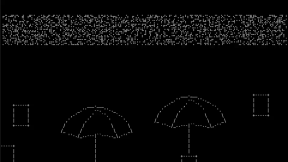
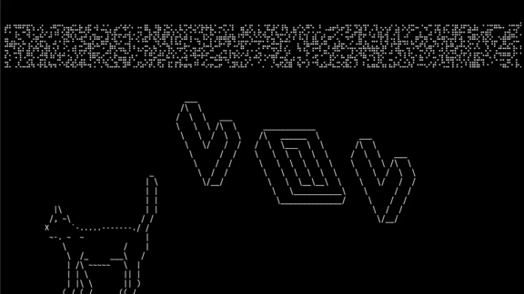
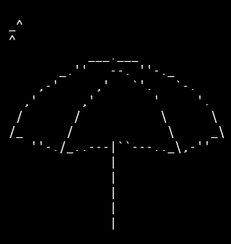
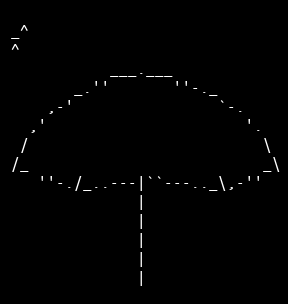
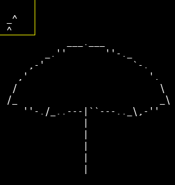
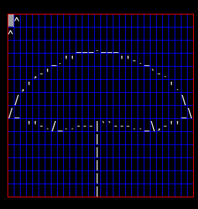
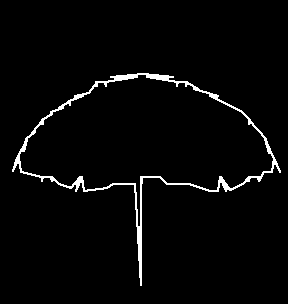
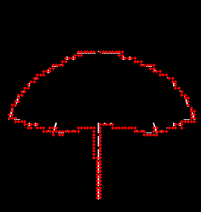
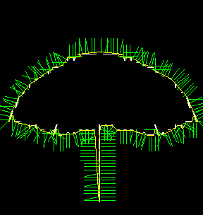

# sloper 0.9
Sloper calculate surface shape (normal vectors to the surface) of ASCII figure that later can be used by ASCII physic engine (ascii_engine.py).

## ascii_engine.py (demos)
<p align="center">


</p>

## Dependencies
Tested with:
- numpy            1.16.3
- tinyarray        1.2.1
- opencv-python    4.1.0.25
- Pillow           6.0.0

## Requirements
Sloper use very simple method to find surface shape (at least in this version), that's why any input data must be pre-processed by user.
First of all each figure must contain marker at the top-left corner in 3x3 area, that help sloper calculate cell and grid size.
```
_^
^
```
Secondly, figure must be "drilled" from all characters that are not part of surface.

<p align="center">


</p>

When grid and markers are calculated, sloper find nearest neighbor to each character, and join them to get figure contour.

<p align="center">



</p>

Next for each point, where braille dot may appear, sloper calculate normal vector to the surface in this point.

<p align="center">


</p>

## Usage
```
$ python sloper.py -a ascii_data/umbrella-drilled.txt
```
